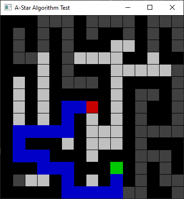

# A* Pathfinding Grid
Pathfinding program that finds the optimal path between two nodes using the A* algorithm.

## Requisites 
* OpenCV 4.3.0 (Python)
* numpy 1.18.1

## Description
The `Nodes` class' `__init__()` method takes arguments that allow the user to create a grid of `n x n` equally spaced `Node` objects. You can double left-click and double right-click any of the nodes to shift the starting and ending nodes around the grid, or click on other nodes to make them walls/obstacles. The path calculated by this script is assumed to only move in 4 directions (NSEW)~~, but you can uncomment the diagonal section of the code to allow for 8 directional movement~~. All nodes that were activated by the algorithm are also shown.

## References
*  - javidx9
